# Legends Manager

LCK 선수 카드를 수집하고, 강화하고, 5인 스쿼드를 조합해서 시즌을 진행하는 카드 수집형 웹 게임입니다. 가챠의 수집 재미와 FM 스타일의 운영 감각을 한 프로젝트 안에 묶는 것을 목표로 만들었습니다.

## 프로젝트 소개

- **장르**: LCK 테마 카드 수집 / 가챠 / 스쿼드 빌딩 / 리그 시뮬레이션
- **플랫폼**: React + TypeScript + Vite 기반 웹 앱
- **핵심 루프**: 카드 뽑기 → 중복 분해 및 강화 → 5인 스쿼드 구성 → 시너지 활성화 → 리그 진행

## 주요 기능

### 1. 가챠 시스템
- 일반팩, LIVE 2026 팩, 연도별 팩, 포지션별 팩 제공
- 단일 뽑기 / 10연차 지원
- S 소프트/하드 천장, A 천장, 10연차 A 이상 보장 구현
- S 등급 카드 전용 FIFA 스타일 연출 포함

### 2. 카드 육성 및 샤드 시스템
- 중복 카드는 자동으로 샤드로 환산
- 샤드로 A/S 카드 제작 가능
- LIVE 카드 전용 제작 비용 분리
- 강화는 `SUCCESS / KEEP / BREAK` 결과를 가지며, 파괴 카드 복구 흐름도 포함

### 3. 컬렉션 / 도감
- 보유 카드 필터링, 검색, 정렬, 페이지네이션
- 카드 상세 보기와 강화 UI 제공
- 도감에서 발견한 카드 추적
- 시너지 조합 레퍼런스 확인 가능

### 4. 스쿼드 빌더
- TOP / JGL / MID / ADC / SUP 5인 로스터 구성
- 평균 OVR 및 세부 스탯 합산
- 팀/연도/LIVE 기반 시너지 계산
- 스쿼드 이미지 저장 및 공유 URL 생성 지원

### 5. 리그 진행
- 완성된 5인 스쿼드로 리그 진입
- 정규 시즌, 플레이오프, 시즌 결과 화면 제공
- 경기 전 전략 선택, 리스크 조절, 우선 라인 연계, 경기 후 피드백 선택 가능

### 6. 로그인 / 클라우드 저장
- Supabase Auth 기반 로그인
- Google OAuth, Kakao OAuth 연동
- 사용자 게임 데이터, 보유 카드, 스쿼드를 Supabase에 저장

## 게임 화면 소개

아래 이미지는 저장소의 `readme_image/` 폴더에 들어 있는 실제 플레이 화면입니다. README를 처음 보는 사람도 게임의 흐름이 바로 읽히도록, 진입 → 수집 → 운영 → 도감 → 시너지 순서로 배치했습니다.

### 1. 메인화면

메인 화면에서는 보유 재화, 출석 보상, 천장 진행도와 함께 현재 스쿼드의 5인 로스터를 한눈에 볼 수 있습니다. 하단에는 총 OVR, 평균 OVR, 세부 능력치, 활성 시너지가 함께 배치되어 있어서 지금 팀이 얼마나 강한지 즉시 파악할 수 있습니다.

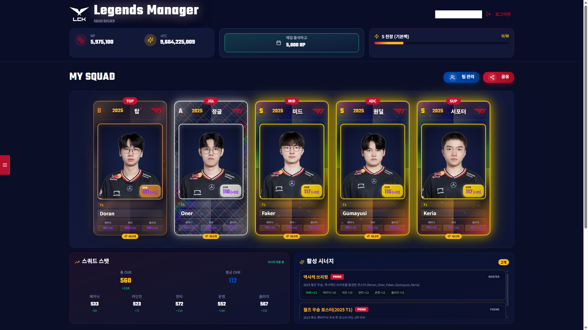

### 2. 카드팩

카드팩 화면에서는 일반팩, LIVE 팩, 연도별 팩, 포지션별 팩을 나눠서 선택할 수 있습니다. 단일 뽑기와 10연차, 등급별 확률, 현재 팩의 천장 현황과 보장 조건이 한 화면에 모여 있어 이 프로젝트의 가챠 설계를 그대로 보여줍니다.

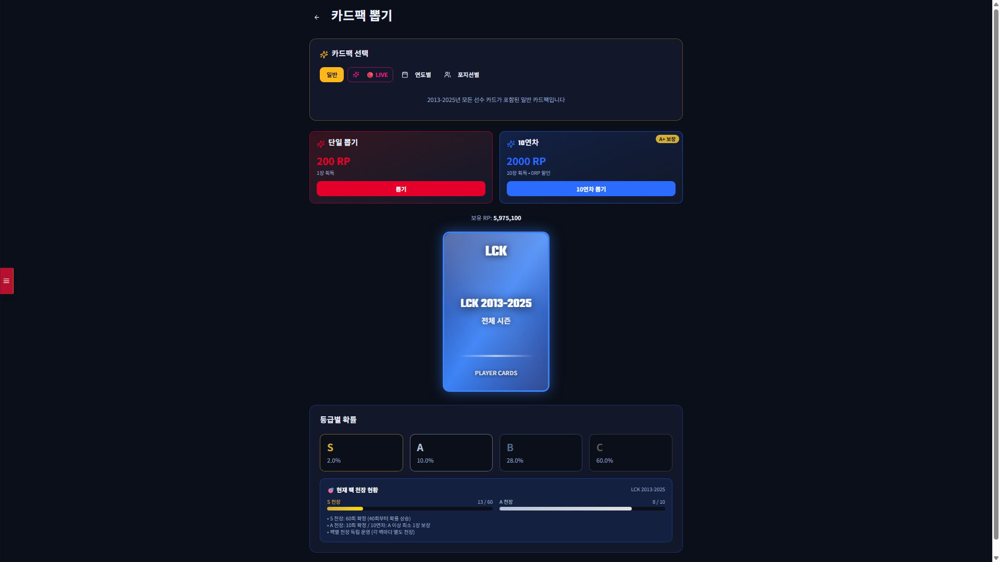

### 3. 리그진행

리그 모드에서는 시즌을 시작할 리그를 고른 뒤, 경기 전 전략 선택과 실제 경기 진행을 거쳐 결과까지 이어지는 운영형 플레이 루프를 즐길 수 있습니다. 아래 이미지는 경기 리플레이 장면으로, 상대 팀과의 흐름·킬 스코어·오브젝트·골드 차이까지 확인할 수 있는 실제 진행 화면입니다.

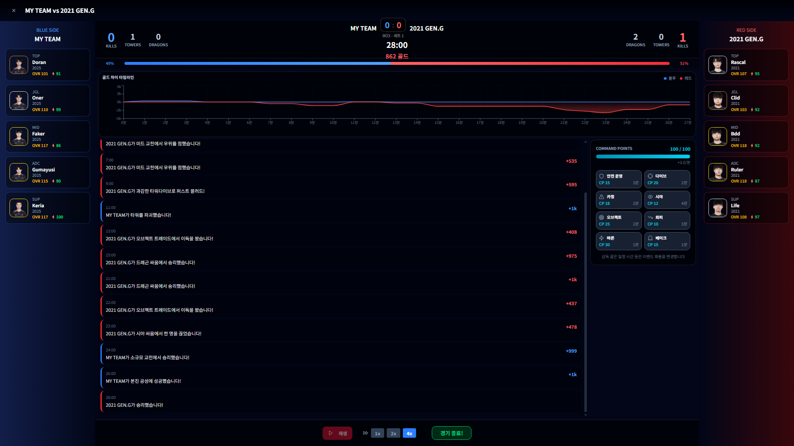

### 4. 도감

도감 화면에서는 연도별 필터와 정렬 옵션을 사용해 전체 선수 카드를 탐색할 수 있습니다. 수집 현황과 보유율을 함께 확인할 수 있어서, 단순 인벤토리보다 더 완성형 컬렉션 관리 화면에 가깝게 구성되어 있습니다.

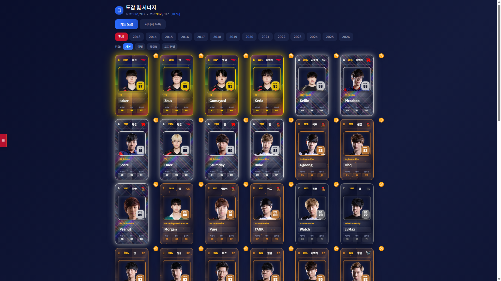

### 5. 시너지와 카드 효과

시너지 화면에서는 ROSTER, TRIO, DUO, THEME 조건별 시너지 카드가 정리되어 있고, 어떤 선수 조합이 어떤 능력치 상승을 주는지 바로 확인할 수 있습니다. 덱 조합을 맞추는 재미를 단순 수치가 아니라 카드 조합 규칙으로 풀어낸 것이 이 시스템의 핵심입니다.

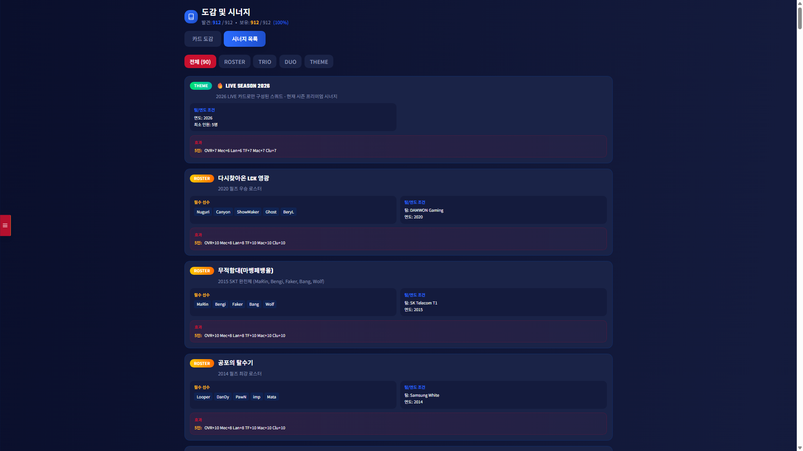

실제 선수 카드는 단순한 정적 이미지가 아니라, 마우스 오버 시 커서 위치를 따라 3D로 기울어지고 광택(glare) 위치가 함께 이동하는 홀로그램 카드로 렌더링됩니다. 구현은 `src/components/LCKHoloCard.tsx`에 들어 있으며, 등급별 홀로그램 패턴, LIVE 카드 전용 효과, 앞/뒷면 플립, 강화 오라까지 포함되어 있습니다.

아래 GIF는 실제 카드에 마우스를 올렸을 때의 홀로그램 효과와 강화 연출을 보여줍니다.

#### 카드 호버링 효과


커서 위치에 따라 카드가 3D로 기울고, 반사광이 함께 움직이면서 실제 수집형 카드 같은 질감을 느낄 수 있게 만들었습니다.

#### 카드 강화 연출


강화 단계가 올라갈수록 카드 분위기와 오라가 더 강해지도록 설계해서, 단순 수치 상승이 아니라 육성의 시각적 만족감도 함께 전달되도록 구성했습니다.

#### 실제 카드 렌더링 예시

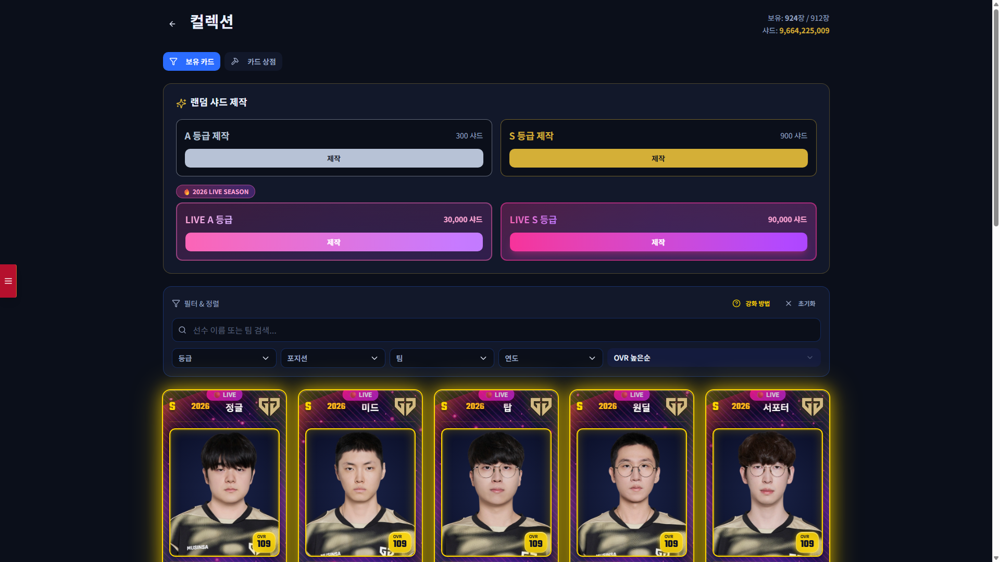

## 선수단 예시

실제 플레이에서는 연도와 팀 조합에 따라 서로 다른 테마의 선수단을 구성할 수 있습니다. 아래 이미지는 README용으로 추가한 대표 예시 스쿼드들입니다.

> ⚠️ 경고
> 아래 선수단 이미지, 카드 관련 GIF, 팀 로고, 선수 이미지 등은 별도 라이선스 또는 사용 조건이 적용될 수 있습니다.
> 이 저장소의 소스코드와 별개로, 해당 미디어를 광고, 홍보, 상업적 마케팅, 브랜드 프로모션 용도로 사용하는 것은 허용되지 않을 수 있으므로 반드시 별도 권리 범위를 확인하세요.

| 시즌 / 팀 | 예시 이미지 |
|---|---|
| 2013 CJ Entus | 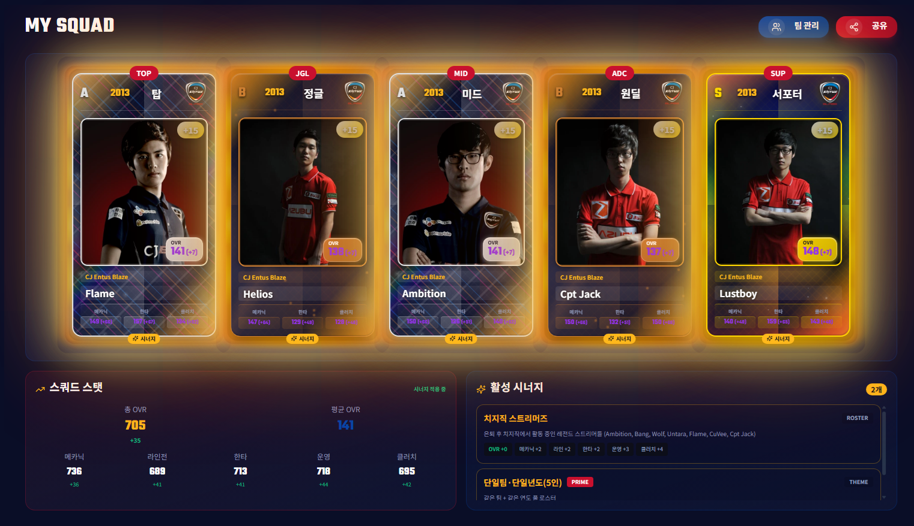 |
| 2015 SKT T1 | 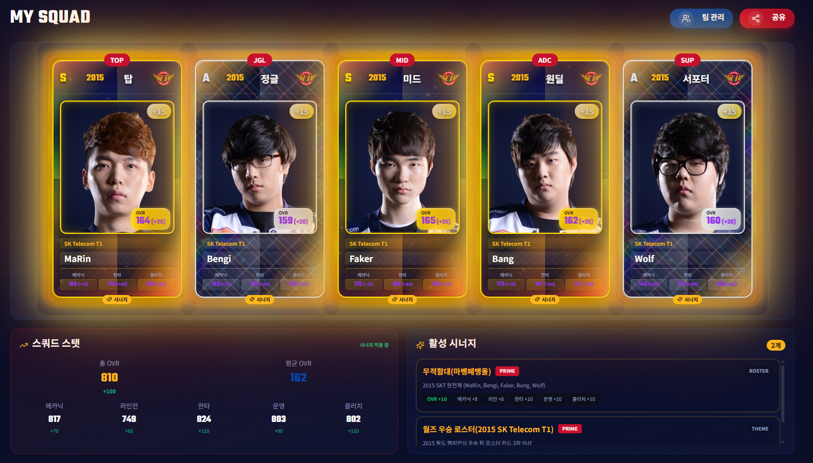 |
| 2016 ROX Tigers | 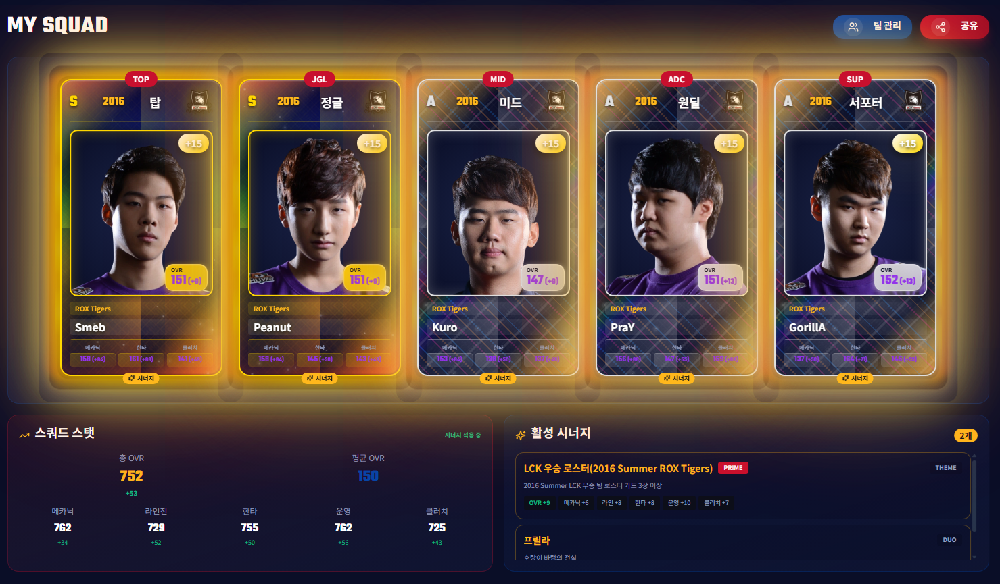 |
| 2017 KT Rolster | 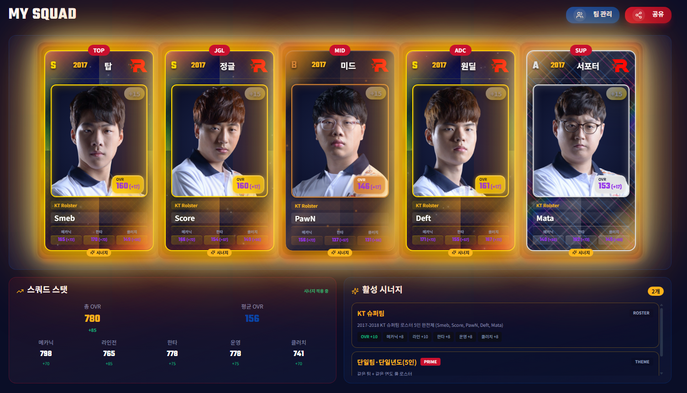 |
| 2019 Griffin | 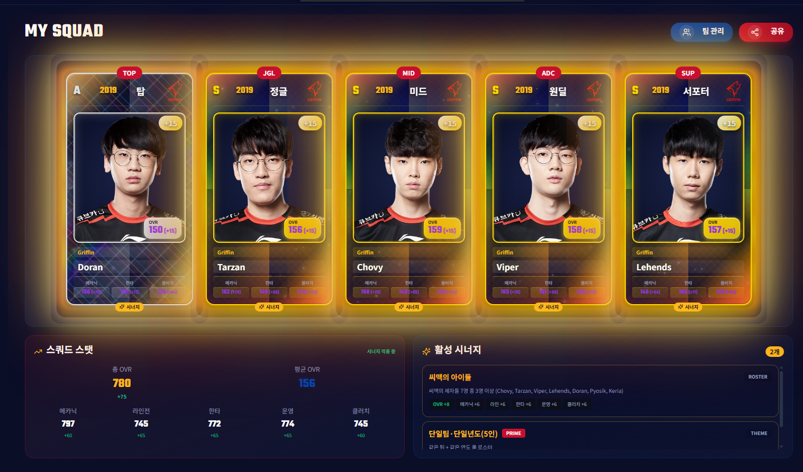 |
| 2020 DAMWON Gaming | 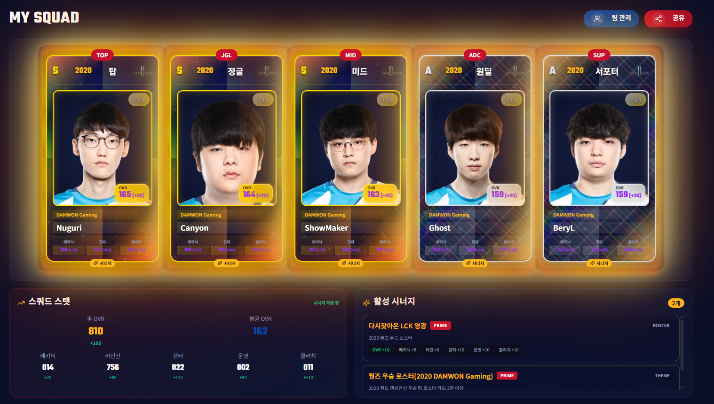 |

이런 식으로 시대별 대표 로스터를 맞춰서 팀 시너지와 선수 조합의 맛을 동시에 즐길 수 있습니다.

## 기술 스택

- React 18
- TypeScript
- Vite 6
- Tailwind CSS 4
- Radix UI / shadcn-ui
- Motion
- Supabase Auth / Database / Storage / Edge Functions

## 로컬 실행 방법

### 1. 요구 사항
- Node.js 20+
- npm
- Supabase 프로젝트 1개

### 2. 설치

```bash
npm install
```

### 3. 환경 변수 파일 준비

루트에 `.env` 파일을 만들고 `.env.example`을 참고해서 값을 채워주세요.

브라우저 클라이언트에서 사용하는 값:

```env
VITE_SUPABASE_PROJECT_ID=your-project-id
VITE_SUPABASE_ANON_KEY=your-browser-anon-key
VITE_SUPABASE_FUNCTIONS_BASE_PATH=make-server-ffd115c0
VITE_SUPABASE_AUTH_STORAGE_KEY=sb-legends-manager-auth-token
```

서버/스크립트/Edge Function에서 사용하는 값:

```env
SUPABASE_URL=https://your-project.supabase.co
SUPABASE_ANON_KEY=your-browser-anon-key
SUPABASE_SERVICE_ROLE_KEY=your-service-role-key
```

> `SUPABASE_SERVICE_ROLE_KEY`는 절대 브라우저 코드나 공개 문서 스크린샷에 노출하면 안 됩니다.

### 4. 개발 서버 실행

```bash
npm run dev
```

### 5. 프로덕션 빌드

```bash
npm run build
```

## Supabase 구축 방법

### 필수 파일 / 폴더
- `.env.example` - 공개용 환경 변수 템플릿
- `src/utils/supabase/info.tsx` - 브라우저용 Supabase 식별자 읽기
- `src/utils/supabaseAuth.ts` - Supabase Auth 클라이언트 생성
- `src/utils/supabaseApi.ts` - Edge Function 호출 래퍼
- `src/utils/supabaseDirect.ts` - 클라이언트 직접 테이블 접근 유틸
- `supabase/functions/server/` - Edge Function 서버 코드
- `supabase/migrations/` - DB 마이그레이션 SQL
- `scripts/upload-images.js` - Storage 이미지 업로드 스크립트
- `scripts/README.md` - Storage 이미지 업로드 상세 가이드

### 필요한 Supabase 기능

#### Auth
- Google OAuth
- Kakao OAuth
- Site URL / Redirect URL 설정 필요

로컬 개발 시 예시:
- `http://localhost:5173`
- `http://localhost:5173/`

배포 후에는 실제 도메인을 같은 방식으로 추가해야 합니다.

#### Database
이 프로젝트는 아래 테이블/구조를 사용합니다.

- `lck_cards`
- `user_profiles`
- `user_game_data`
- `user_cards`
- `user_squads`
- `kv_store_ffd115c0`

#### Storage
다음 버킷이 필요합니다.

- `lck-player-images` (public)
- `team-logos` (public)

### 마이그레이션 적용 순서

SQL Editor 또는 Supabase CLI 기준으로 아래 순서를 권장합니다.

1. `supabase/migrations/001_create_lck_cards.sql`
2. `supabase/migrations/20250118_create_user_tables.sql`
3. `supabase/migrations/20250121_create_new_user_trigger.sql`
4. `supabase/migrations/20250130_fix_user_profiles_schema.sql`
5. `supabase/migrations/20250130_fix_user_trigger_v2.sql`

추가 참고 문서:
- `supabase/migrations/README_MIGRATION.md`
- `AUTH_SETUP_GUIDE.md`
- `DEPLOYMENT.md`

### Edge Function

현재 프론트엔드는 기본적으로 아래 Function base path를 사용합니다.

```env
VITE_SUPABASE_FUNCTIONS_BASE_PATH=make-server-ffd115c0
```

함수 이름을 바꿨다면 `.env`에서 같이 맞춰주세요.

### Storage 이미지 업로드

```bash
node scripts/upload-images.js
```

세부 사용법은 `scripts/README.md`를 참고하세요.

## 주의 사항

- 이 저장소에는 실제 운영용 secret key를 커밋하지 마세요.
- `anon key`는 브라우저에서 사용될 수 있지만, 오픈소스 공개용 저장소에서는 환경 변수로 분리하는 쪽이 관리에 안전합니다.
- OAuth Redirect URL은 Supabase Dashboard 설정과 코드의 `window.location.origin` 흐름이 일치해야 합니다.
- `readme_image/`의 스크린샷/GIF와 별개로, 실제 게임에 사용되는 선수 이미지·팀 로고·외부 에셋은 별도 권리 확인 후 재배포 범위를 판단하는 것을 권장합니다.
- 특히 선수단 이미지, 카드 GIF, 팀 로고, 선수 사진을 광고·홍보·프로모션 용도로 재사용하려면 오픈소스 라이선스와 별개로 별도 사용 허가가 필요할 수 있습니다.

## 라이선스

MIT
